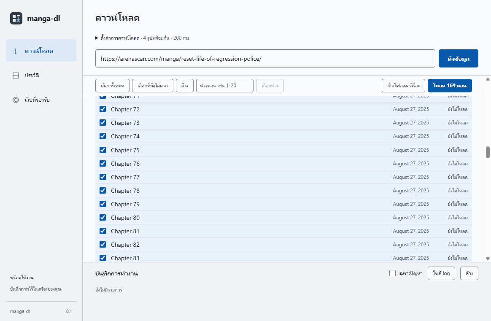

# manga-dl

Desktop app that saves the chapters of a series as ordered image folders, ready for a translation pipeline. Each website is a separate module, so new sites can be added without touching the core.



## Features

- Paste a series link, pick chapters, download
- Resume: intact pages and finished chapters are skipped
- Every problem is reported with a typed error code and a hint; full JSONL logs per job
- History page grouped by series, read from the output folder
- Supported sites page
- Light and dark themes

## Download

Grab the latest `setup` or `portable` exe from [Releases](../../releases), or from the artifacts of the latest [Build](../../actions/workflows/build.yml) run.

The exe is not code signed, so Windows SmartScreen will warn on first launch.

## Development

Requires Node.js 24.

```sh
npm install
npm run dev        # run with hot reload
npm start          # build, then run
npm test           # unit tests
npm run typecheck
npm run dist       # build installer and portable exe into release/
```

## Output layout

```
<output folder>/<site id>/<series title>/<0001>/001.jpg
<output folder>/<site id>/<series title>/manifest.json
<output folder>/logs/<timestamp>.jsonl
```

## Adding a site

1. Create `src/sites/<name>.ts` that exports a `SiteAdapter` (see `src/core/types.ts`). Sites built on the WordPress MangaReader theme only need a small config for `createMangaReaderAdapter`, like `src/sites/arenascan.ts`.
2. Register it in `src/sites/index.ts`.
3. Add parser tests with a reduced HTML fixture in `tests/fixtures/`.

## Releasing

Push a tag such as `v0.1.0`. The Build workflow attaches both exe files to a GitHub release.

## Notice

Download only content you have the right to save. Respect each site's terms of use.
